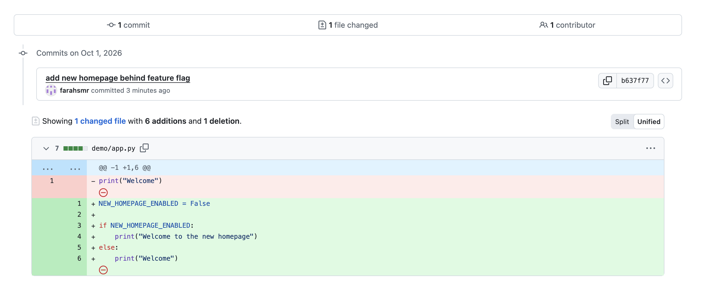
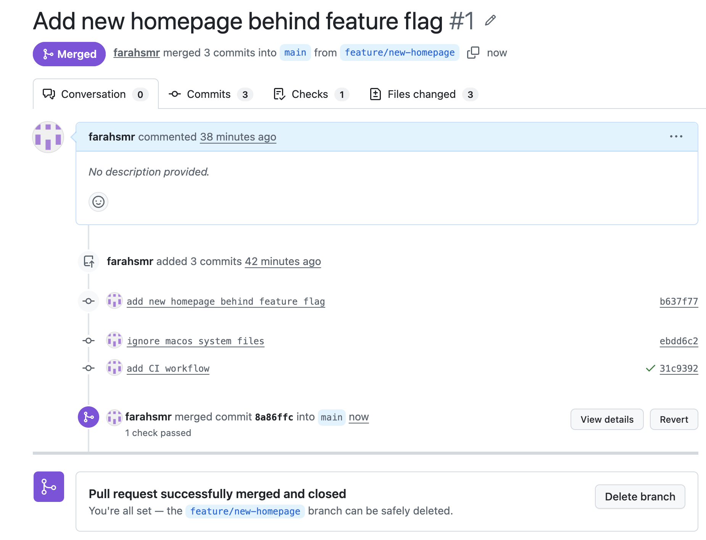
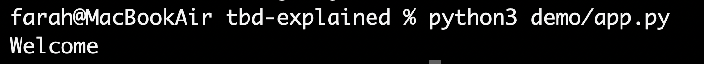
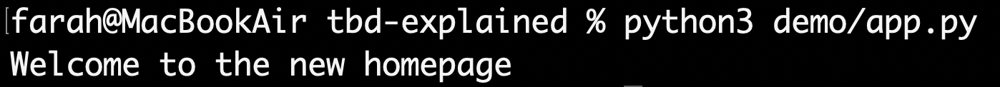
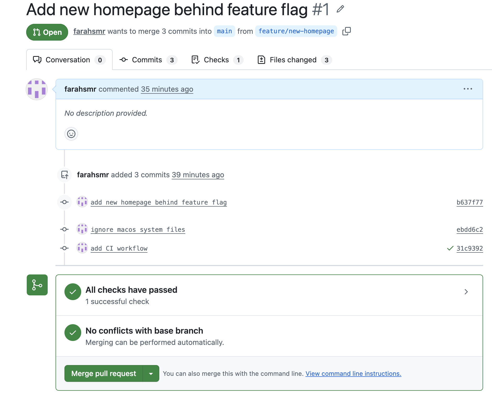

# Trunk Based Development

*Started writing on June 30, 2026*

It all started when I came across a talk from code.talks 2023: Ludovic Toison’s [*“Our Journey from Gitflow to Trunk Based Development”*](https://www.youtube.com/watch?v=DDkjBqlks40). What caught my attention wasn’t just trunk-based development itself, but the fact that an entire team had decided to change the way they worked around it. The more tutorials I watched and articles I read, the more intuitive the approach started to feel, almost like the opposite of the branch-heavy Git workflow most of us are introduced to first.

I’m writing this mainly for two reasons. The first is pretty simple: I learn best by explaining things. If I can’t explain something clearly to someone else, I probably don’t understand it well enough yet. The second is that trunk-based development still doesn’t seem to be that widely known. Even a few senior engineers I’ve spoken to hadn’t heard of it, which made me think that a plain-language introduction might actually be worth writing.

> **A small note:** I’m a recent CS graduate and still early in my own journey, so this is written from my current understanding rather than from the perspective of an expert. If you notice something I’ve misunderstood or explained incorrectly, feel free to let me know.

## The Bigger Picture
A common way of working with Git is using feature branches. A task gets its own branch, work happens there, and once it is finished the branch gets merged back into main.
That is also the workflow I was most familiar with, so at first trunk-based development sounded a bit strange. The main difference is really how long work stays separate.

With a long-lived feature branch, development can continue there for days or even weeks while main is changing at the same time. Meanwhile, other people are adding code, changing files, refactoring things and eventually the branch has to be merged back, but by then both sides may have changed quite a lot.

TBD tries to keep that gap small. There is still one main branch, usually main, and developers keep integrating their changes back into it instead of letting branches grow for a long time.
Branches can still exist. That part confused me at first because some explanations make trunk-based development sound like everybody has to work directly on main, which is not necessarily the case.


```text
main
 ├── feature/login-validation
 ├── fix/navbar-spacing
 └── refactor/user-service
```

The difference is that these branches are meant to be temporary. A small change is made, reviewed, merged, and then the branch is gone again.
## The Trunk

The word *trunk* sounds more technical than it actually is. It is simply the main line of development, which in most Git repositories means `main`.

```text
trunk = main
```

As mentioned above, the feature branch can still exist. The difference here is that it should not turn into a second version of the project that stays separate for weeks.

A longer-lived branch could look something like this:

```text
main      A-----B---------------------------F
                \                         /
feature          C---D---E---G---H---I---
```

Both sides keep changing until they eventually have to be brought together again.

With trunk-based development, the branch stays much closer to `main`:

```text
main      A---B---C---D---E---F
              \_/     \_/
```

To try this myself, I created a small branch called:

```text
feature/new-homepage
```

The change here was intentionally small, as it only added a simple feature flag around a new homepage message.

The pull request ended up being one changed file with six additions and one deletion:



After the change passed the checks, I merged the branch back into `main` and deleted it.



## What About Unfinished Code?

The feature flag would be the most useful part of the demo to understand this.
After the pull request had already been merged into `main`, the new homepage code was there, but the flag was still set to:

```python
NEW_HOMEPAGE_ENABLED = False
```

Running the program still gave:

```text
Welcome
```



Then I changed only the flag:

```python
NEW_HOMEPAGE_ENABLED = True
```

and ran the same program again:

```text
Welcome to the new homepage
```



That also made the difference between deployment and release easier to understand, since the code can already be integrated while the feature itself stays disabled until it is ready.

## Smaller Changes

Here is where the idea of small changes started to make more sense.
The demo pull request changed only one file, which was very little to review, and it was even obvious what the change was supposed to do.

A real feature would obviously be larger, but it can still be split into smaller parts. A search feature, for example, does not necessarily need to arrive as one large pull request containing the backend, API, frontend, tests, and everything around it.
Those parts can be added gradually as long as each change leaves the shared branch in a usable state.

That seems to be a big part of trunk-based development: not making the work smaller just for the sake of it, but avoiding a large amount of isolated work that only gets integrated at the end.


## CI

The next thing I tried was adding CI to the pull request.
I created a small GitHub Actions workflow that checks `app.py` automatically whenever a pull request is opened or something is pushed to `main`.

```yaml
# PR opened
#    ↓
# GitHub runs CI automatically
#    ↓
# checks app.py
#    ↓
# valid → green check
# broken → red check

name: CI

on:
  pull_request:
  push:
    branches:
      - main

jobs:
  check-python:
    runs-on: ubuntu-latest

    steps:
      - name: Get repository code
        uses: actions/checkout@v4

      - name: Set up Python
        uses: actions/setup-python@v5
        with:
          python-version: "3.12"

      - name: Check Python file
        run: python -m py_compile demo/app.py
```

For this demo it only checks whether the Python file has valid syntax. A real project would usually run more useful things here, such as tests or linting...

After I pushed the workflow, the check appeared directly on the pull request:



I had seen green checks on GitHub many times before, but setting one up myself made it much clearer where they actually come from and what happens before a pull request gets that check.

## Final Thoughts

Before reading about trunk-based development, I mostly thought about branches by what they were for:

```text
feature → feature branch
bug     → bugfix branch
```

I did not pay much attention to how long they existed, and this is probably the biggest change for me.
The demo was obviously very small, but going through the whole process myself helped a lot. Creating the branch, opening the pull request, watching CI run and then merging it made the idea feel much less abstract.
What I originally understood as another Git branching strategy now feels more like a way of avoiding work staying separate for too long.
I also think this is the part I will probably keep in mind the next time I work in a larger project: not just what branch to create, but how long that branch should really stay around.


## Sources

- [Ludovic Toison - “Our Journey from Gitflow to Trunk Based Development”](https://www.youtube.com/watch?v=DDkjBqlks40)
- [Trunk Based Development - Introduction](https://trunkbaseddevelopment.com/)
- [Trunk Based Development - Short-Lived Feature Branches](https://trunkbaseddevelopment.com/short-lived-feature-branches/)
- [Martin Fowler - Feature Flags](https://martinfowler.com/bliki/FeatureFlag.html)
- [GitHub Docs - Building and testing Python with GitHub Actions](https://docs.github.com/en/actions/tutorials/build-and-test-code/python?learn=continuous_integration)

